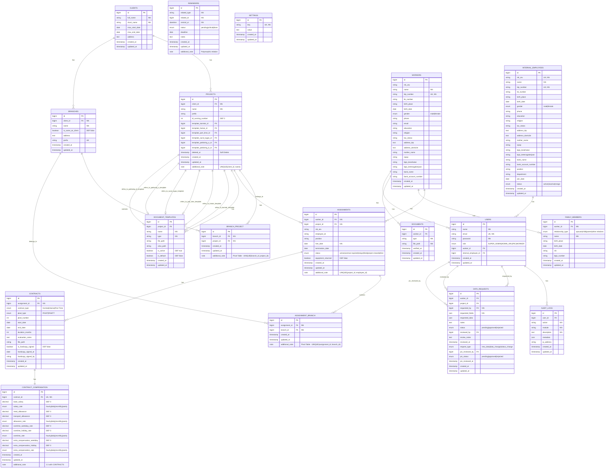

```mermaid
erDiagram

    CLIENTS {
        bigint id PK
        string full_name "NN"
        string short_name "NN"
        date mou_start_date
        date mou_end_date
        text address
        timestamp created_at
        timestamp updated_at
    }

    PROJECTS {
        bigint id PK
        bigint client_id FK "NN"
        string name "NN"
        string prefix
        int id_running_number "DEF 0"
        bigint template_kontrak_id FK
        bigint template_harian_id FK
        bigint template_part_time_id FK
        bigint template_surat_tugas_id FK
        bigint template_paklaring_a_id FK
        bigint template_paklaring_b_id FK
        timestamp deleted_at "Soft Delete"
        timestamp created_at
        timestamp updated_at
        note additional_note "UNIQUE(client_id, name)"
    }

    BRANCHES {
        bigint id PK
        bigint client_id FK "NN"
        string name "NN"
        boolean is_same_as_client "DEF false"
        text address
        string prefix "UK"
        timestamp created_at
        timestamp updated_at
    }

    BRANCH_PROJECT {
        bigint id PK
        bigint branch_id FK "NN"
        bigint project_id FK "NN"
        timestamp created_at
        timestamp updated_at
        note additional_note "Pivot Table - UNIQUE(branch_id, project_id)"
    }

    WORKERS {
        bigint id PK
        string nik_aru
        string name "NN"
        string ktp_number "UK, NN"
        string kk_number
        string birth_place
        date birth_date
        enum gender "male|female"
        string phone
        string email
        string education
        string religion
        string tax_status
        text address_ktp
        text address_domicile
        string mother_name
        string npwp
        string bpjs_kesehatan
        string bpjs_ketenagakerjaan
        string bank_name
        string bank_account_number
        timestamp created_at
        timestamp updated_at
    }

    ASSIGNMENTS {
        bigint id PK
        bigint worker_id FK "NN"
        bigint project_id FK "NN"
        string nik_aru
        string employee_id
        string position
        date hire_date "NN"
        date termination_date
        enum status "active|contract expired|resign|fired|project closed|other"
        boolean equipment_returned "DEF false"
        timestamp created_at
        timestamp updated_at
        note additional_note "UNIQUE(project_id, employee_id)"
    }

    ASSIGNMENT_BRANCH {
        bigint id PK
        bigint assignment_id FK "NN"
        bigint branch_id FK "NN"
        timestamp created_at
        timestamp updated_at
        note additional_note "Pivot Table - UNIQUE(assignment_id, branch_id)"
    }

    CONTRACTS {
        bigint id PK
        bigint assignment_id FK "NN"
        enum contract_type "Kontrak|Harian|Part Time"
        enum pkwt_type "PKWT|PKWTT"
        int pkwt_number
        date start_date
        date end_date
        int duration_months
        text evaluation_notes
        string file_path
        boolean is_hardcopy_signed "DEF false"
        date hardcopy_signed_at
        string hardcopy_signed_by
        timestamp created_at
        timestamp updated_at
    }

    CONTRACT_COMPENSATION {
        bigint id PK
        bigint contract_id FK "UK, NN"
        decimal base_salary "DEF 0"
        enum salary_rate "hourly|daily|monthly|yearly"
        decimal meal_allowance "DEF 0"
        decimal transport_allowance "DEF 0"
        enum allowance_rate "hourly|daily|monthly|yearly"
        decimal overtime_weekday_rate "DEF 0"
        decimal overtime_holiday_rate "DEF 0"
        enum overtime_rate "hourly|daily|monthly|yearly"
        decimal extra_compensation_weekday "DEF 0"
        decimal extra_compensation_holiday "DEF 0"
        enum extra_compensation_rate "hourly|daily|monthly|yearly"
        timestamp created_at
        timestamp updated_at
        note additional_note "1:1 with CONTRACTS"
    }

    FAMILY_MEMBERS {
        bigint id PK
        bigint worker_id FK "NN"
        enum relationship_type "spouse|child|parent|other relatives"
        string name "NN"
        string birth_place
        date birth_date
        string nik
        string bpjs_number
        timestamp created_at
        timestamp updated_at
    }

    USERS {
        bigint id PK
        string name "NN"
        string email "UK, NN"
        string password "NN"
        enum role "SUPER_ADMIN|ADMIN_ARU|PIC|WORKER"
        bigint worker_id FK
        bigint internal_employee_id FK
        timestamp created_at
        timestamp updated_at
    }

    INTERNAL_EMPLOYEES {
        bigint id PK
        string nik_aru "UK, NN"
        string name "NN"
        string ktp_number "UK, NN"
        string kk_number
        string birth_place
        date birth_date
        enum gender "male|female"
        string phone
        string education
        string religion
        string tax_status
        text address_ktp
        text address_domicile
        string mother_name
        string npwp
        string bpjs_kesehatan
        string bpjs_ketenagakerjaan
        string bank_name
        string bank_account_number
        string position
        string department
        date join_date
        enum status "active|inactive|resign"
        timestamp created_at
        timestamp updated_at
    }

    REMINDERS {
        bigint id PK
        string related_type "NN"
        bigint related_id "NN"
        datetime remind_at "NN"
        enum status "pending|critical|done"
        date deadline
        text notes
        timestamp created_at
        timestamp updated_at
        note additional_note "Polymorphic relation"
    }

    DOCUMENTS {
        bigint id PK
        bigint worker_id FK
        string type "NN"
        string file_path "NN"
        timestamp verified_at
        timestamp created_at
        timestamp updated_at
    }

    DOCUMENT_TEMPLATES {
        bigint id PK
        bigint project_id FK
        string name "NN"
        string type "NN"
        string file_path
        string view_path
        boolean is_active "DEF true"
        boolean is_default "DEF false"
        timestamp created_at
        timestamp updated_at
    }

    DATA_REQUESTS {
        bigint id PK
        bigint worker_id FK
        bigint project_id FK
        bigint requested_by FK "NN"
        json requested_fields "NN"
        json requested_data
        text notes
        enum status "pending|approved|rejected"
        bigint reviewed_by FK
        text review_notes
        timestamp reviewed_at
        enum request_type "new_data|data_change|status_change"
        bigint pic_reviewed_by FK
        enum pic_status "pending|approved|rejected"
        timestamp pic_reviewed_at
        timestamp created_at
        timestamp updated_at
    }

    AUDIT_LOGS {
        bigint id PK
        bigint user_id FK
        string action "NN"
        string module "NN"
        text description "NN"
        json metadata
        string ip_address
        timestamp created_at
        timestamp updated_at
    }

    SETTINGS {
        bigint id PK
        string key "UK, NN"
        text value
        timestamp created_at
        timestamp updated_at
    }

    CLIENTS ||--o{ PROJECTS : has
    CLIENTS ||--o{ BRANCHES : has
    BRANCHES ||--o{ BRANCH_PROJECT : contains
    PROJECTS ||--o{ BRANCH_PROJECT : belongs_to
    PROJECTS ||--o{ ASSIGNMENTS : has
    WORKERS ||--o{ ASSIGNMENTS : has
    ASSIGNMENTS ||--o{ ASSIGNMENT_BRANCH : contains
    BRANCHES ||--o{ ASSIGNMENT_BRANCH : belongs_to
    ASSIGNMENTS ||--o{ CONTRACTS : has
    CONTRACTS ||--|| CONTRACT_COMPENSATION : has
    WORKERS ||--o{ FAMILY_MEMBERS : has
    WORKERS ||--o{ DOCUMENTS : has
    WORKERS ||--o{ USERS : has
    INTERNAL_EMPLOYEES ||--o{ USERS : has
    PROJECTS ||--o{ DOCUMENT_TEMPLATES : has
    PROJECTS ||--o| DOCUMENT_TEMPLATES : refers_to_kontrak_template
    PROJECTS ||--o| DOCUMENT_TEMPLATES : refers_to_harian_template
    PROJECTS ||--o| DOCUMENT_TEMPLATES : refers_to_part_time_template
    PROJECTS ||--o| DOCUMENT_TEMPLATES : refers_to_surat_tugas_template
    PROJECTS ||--o| DOCUMENT_TEMPLATES : refers_to_paklaring_a_template
    PROJECTS ||--o| DOCUMENT_TEMPLATES : refers_to_paklaring_b_template
    USERS ||--o{ AUDIT_LOGS : has
    USERS ||--o{ DATA_REQUESTS : requested_by
    USERS ||--o{ DATA_REQUESTS : reviewed_by
    USERS ||--o{ DATA_REQUESTS : pic_reviewed_by
```